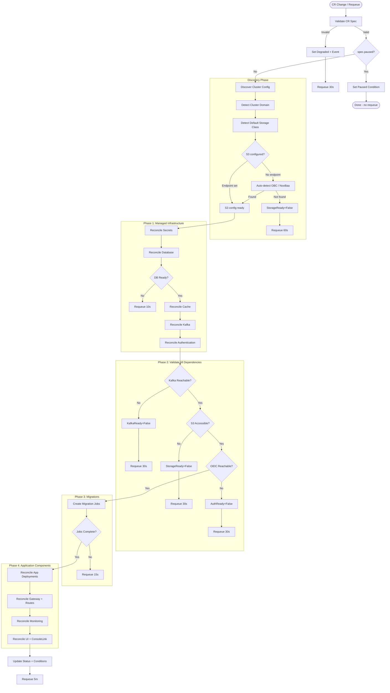

# Cost Management On-Premise Operator Architecture

---

## 1. Executive Summary

### Current State

The cost-onprem application is deployed via a **Helm chart** (v0.2.20-rc3) orchestrated by bash scripts (~5000 lines total). The system manages **~71 Kubernetes resource templates** across these component groups:

- **Infrastructure**: PostgreSQL StatefulSet, Valkey (cache) Deployment + PVC
- **Cost Management (Koku)**: API, MASU, Listener, Celery Beat, 10 Celery worker queues (6 active, 4 disabled for on-prem)
- **ROS (Resource Optimization)**: API, Processor, Recommendation Poller, Housekeeper, Partition Cleaner CronJob
- **Kruize**: Optimization engine Deployment, ClusterRole/Binding, CronJobs
- **Gateway**: Envoy-based JWT auth proxy
- **Ingress**: Upload service (insights-ingress-go)
- **RBAC Service**: Admin bootstrap Job, migration Job, worker Deployment
- **UI**: OAuth2 Proxy + application container pod
- **Monitoring**: 6 ServiceMonitors, NetworkPolicies, ConsoleLink

### Dependency Model

| Dependency | Relationship | Operator Responsibility |
|---|---|---|
| **PostgreSQL** | Bundled or external | Operator deploys bundled; or connects to external |
| **Valkey (cache)** | Bundled or external | Operator deploys bundled; or connects to external |
| **Kafka (AMQ Streams)** | Managed or external | Operator optionally installs AMQ Streams via OLM; or connects to customer-provided broker |
| **RHBK (Keycloak)** | Managed or external | Operator optionally installs RHBK via OLM; or connects to customer-provided OIDC |
| **S3-compatible storage** | **Prerequisite** | Never installs ODF. If ODF is present, operator auto-detects it (NooBaa, OBC/Ceph RGW). Otherwise, customer provides endpoint + credentials. |
| **Cost Management Metrics Operator** | **Separate product** | NOT managed by this operator. Installed on each reporting cluster by the customer. Future: Thanos Bridge (RHACM) reduces CMMO dependency. |

### Key Anti-Patterns in Current Helm Approach

1. **Script-heavy orchestration**: `install-helm-chart.sh` (2400+ lines), `deploy-rhbk.sh` (1600+ lines), `deploy-kafka.sh` (980+ lines) perform imperative pre-install steps
2. **Manual dependency ordering**: Helm hooks (`pre-install`, `pre-upgrade`) with weight-based ordering
3. **Init container TCP polling**: 5 init container templates poll for DB, Kafka, S3, Kruize, and Koku readiness via `/dev/tcp`
4. **Mutable runtime detection**: Scripts auto-detect cluster domain, storage class, S3 backend, Keycloak URL via `--set` overrides
5. **Non-idempotent secret management**: Scripts create secrets externally before Helm install
6. **Multi-script deployment flow**: Full deploy requires running 3-4 scripts in sequence

Note: `setup-cost-mgmt-tls.sh` is **testing-only** (installs CMMO on the same cluster for E2E testing). It is not part of the production deployment flow.

### Target Architecture

A **Go-based Kubernetes Operator** built with **Operator SDK / controller-runtime**, distributed via **OLM on OpenShift OperatorHub (4.20+)**. The operator manages the full lifecycle through a declarative `CostManagement` Custom Resource.

### Key Constraint: No Migration Path Needed

**There are no existing customers using the Helm chart.** The operator is the **first supported installation method** for cost-management on-premise. This means:
- No Helm-to-operator migration tooling required
- No compatibility period maintaining both installation methods
- No upgrade path from chart to operator
- Freedom to design the CRD API cleanly without backward compatibility constraints
- The Helm chart and scripts serve as **reference implementation** only

---

## 2. Approach Recommendation: Native Go Operator

Given that there are no existing customers and no migration path needed, the strategy comparison simplifies significantly:

### Why Not Helm-Based Operator?

The Helm operator plugin (Strategy A from the previous version) was attractive primarily for migration speed. Without migration concerns:
- Helm hooks, ordering constraints, and templating complexity become pure liability
- The `values.yaml` structure was designed for Helm conventions, not for a clean CRD API
- Script logic (secret generation, S3 validation, Keycloak/Kafka management) cannot live inside Helm templates
- Fine-grained status reporting and drift detection require native Go

### Why Not Hybrid (Helm Library)?

The hybrid approach was designed to support existing Helm users during transition. Without that constraint:
- Carrying Helm as a runtime dependency adds complexity for zero benefit
- Two rendering paths (Helm + native) creates maintenance burden
- The Helm templates are reference material -- reading them while building Go resource builders is sufficient

### Recommended: Native Go Operator (Strategy B)

**Build the operator from scratch using controller-runtime.** The existing Helm templates and scripts serve as the definitive specification of what resources to create and how to configure them.

| Factor | Assessment |
|---|---|
| Time to initial OLM delivery | ~10-12 weeks (infrastructure + core app components) |
| Reuse of existing templates | Reference only -- read templates, build Go equivalents |
| Reconciliation quality | Excellent from day one |
| Drift detection | Per-resource, via Server-Side Apply |
| Long-term maintainability | Excellent -- single rendering path, typed Go |
| Managed dependency lifecycle | Full control (Kafka, Keycloak via OLM APIs) |
| Risk | Moderate -- mitigated by existing E2E test suite |

---

## 3. Operator Architecture

### 3.1 Operator Scope

- **Namespace-scoped** for the primary `CostManagement` CR and all workload resources
- **Cluster-scoped** resources (ConsoleLink, ClusterRole for Kruize, optional OLM Subscriptions) managed via finalizer-based cleanup
- Single operator deployment per namespace

### 3.2 Ownership Boundaries

```
Operator OWNS and RECONCILES:
  Infrastructure (bundled):
    - PostgreSQL StatefulSet + Service + PVC + init ConfigMap
    - Valkey Deployment + Service + PVC

  Infrastructure (managed CRs, optional -- requires dependency operators pre-installed):
    - Kafka CR + KafkaNodePool CRs + KafkaTopic CRs (when kafka.deploy: true; requires AMQ Streams operator)
    - Keycloak CR + KeycloakRealmImport CR + Keycloak DB (when authentication.deploy: true; requires RHBK operator)

  Application:
    - Koku API, MASU, Listener Deployments + Services
    - Celery Beat + Worker Deployments
    - ROS API, Processor, Poller, Housekeeper Deployments + Services
    - Kruize Deployment + Service + CronJobs + ClusterRole/Binding
    - Gateway (Envoy) Deployment + Service + ConfigMap
    - Ingress Deployment + Service
    - RBAC Service Deployment + Jobs
    - UI Deployment + Service (optional)

  Platform:
    - Routes, NetworkPolicies, ServiceMonitors, ConsoleLink
    - Secrets (DB credentials, Django secret key)
    - ConfigMaps (CA bundles, Envoy config, cdappconfig)
    - Migration Jobs (Koku, ROS, RBAC)
    - PrometheusRules (alerts)

Operator DISCOVERS (auto-detects, does not install):
  - ODF ObjectBucketClaim (Direct Ceph RGW) -> extracts endpoint, credentials, bucket names
  - ODF NooBaa (noobaa-admin secret) -> extracts S3 endpoint and credentials
  - Cluster domain, default StorageClass

Operator VALIDATES (does not manage):
  - S3-compatible storage endpoint and bucket access (PREREQUISITE -- ODF auto-detected or user-provided)
  - External Kafka broker (when kafka.deploy: false)
  - External OIDC/Keycloak (when authentication.deploy: false)
  - External PostgreSQL (when database.deploy: false)
  - External Valkey/Redis (when cache.deploy: false)
```

### 3.3 CRD Design

#### Primary CRD: `CostManagement` (costmanagements.cost.redhat.com)

```yaml
apiVersion: cost.redhat.com/v1alpha1
kind: CostManagement
metadata:
  name: costmanagement
  namespace: cost-onprem
spec:
  # --- Infrastructure: Database ---
  database:
    deploy: true                          # true = bundled PostgreSQL; false = external
    storage:
      size: 30Gi
      storageClassName: ""                # auto-detect default SC if empty
    resources:
      requests: { cpu: 100m, memory: 256Mi }
      limits: { cpu: 500m, memory: 512Mi }
    external:                             # Used when deploy: false
      host: ""
      port: 5432
      sslMode: disable
      credentialsSecret: ""               # Secret: postgres-password, ros-password, koku-password, kruize-password

  # --- Infrastructure: Cache ---
  cache:
    deploy: true                          # true = bundled Valkey; false = external
    persistence:
      size: 5Gi
    resources:
      requests: { cpu: 100m, memory: 256Mi }
      limits: { cpu: 500m, memory: 512Mi }
    external:                             # Used when deploy: false
      host: ""
      port: 6379
      authSecret: ""                      # Secret with key: redis-password

  # --- Infrastructure: Kafka ---
  kafka:
    deploy: true                          # true = create Kafka CRs (requires AMQ Streams pre-installed); false = external
    # Kafka cluster configuration (when deploy: true)
    # NOTE: AMQ Streams operator must be installed from OperatorHub BEFORE setting deploy: true
    cluster:
      namespace: ""                       # defaults to operator namespace
    external:                             # Used when deploy: false
      bootstrapServers: ""
      securityProtocol: PLAINTEXT

  # --- Infrastructure: S3-Compatible Object Storage (PREREQUISITE -- operator never installs ODF) ---
  # Auto-detection priority (when endpoint is empty):
  #   1. ObjectBucketClaim "ros-data-ceph" in namespace -> Direct Ceph RGW
  #   2. NooBaa CRD + noobaa-admin secret in openshift-storage -> ODF NooBaa
  # If neither is found and endpoint is empty, operator sets StorageReady=False with guidance.
  objectStorage:
    endpoint: ""                          # Empty = auto-detect ODF/OBC; set explicitly for AWS S3 or other
    port: 443
    useSSL: true
    verifySSL: false                      # internal services often use cluster CA
    region: "onprem"                      # "us-east-1" for AWS S3
    credentialsSecret: ""                 # Empty = auto-extract from OBC/NooBaa; set for pre-existing secret
    buckets:
      ingress: "insights-upload-perma"
      koku: "koku-bucket"
      ros: "ros-data"

  # --- Authentication ---
  authentication:
    deploy: true                          # true = create Keycloak CRs (requires RHBK pre-installed); false = external OIDC
    # RHBK configuration (when deploy: true)
    # NOTE: RHBK operator must be installed from OperatorHub BEFORE setting deploy: true
    rhbk:
      namespace: ""                       # defaults to "<operator-ns>-auth"
      instances: 1
    external:                             # Used when deploy: false
      issuerUrl: ""                       # OIDC issuer URL (e.g., https://keycloak.example.com/realms/kubernetes)
      audiences:
        - cost-management-operator
        - cost-management-ui
    # Common
    realm: kubernetes
    clientId: cost-management-operator

  # --- Cost Management Service (Koku) ---
  costManagement:
    api:
      replicas: 1
      resources:
        requests: { cpu: 250m, memory: 1Gi }
        limits: { cpu: 1, memory: 2Gi }
    masu:
      replicas: 1
      resources:
        requests: { cpu: 250m, memory: 1Gi }
        limits: { cpu: 500m, memory: 2Gi }
    listener:
      replicas: 1
      resources:
        requests: { cpu: 150m, memory: 300Mi }
        limits: { cpu: 300m, memory: 600Mi }
    workers:
      ocp: { replicas: 1, concurrency: 5 }
      priority: { replicas: 1, concurrency: 5 }
      summary: { replicas: 1, concurrency: 5 }
      default: { replicas: 1, concurrency: 5 }
      costModel: { replicas: 1, concurrency: 5 }
    dataRetention:
      months: 3
    # Thanos Bridge (RHACM integration, future)
    thanosBridge:
      enabled: false
      thanosQueryUrl: ""                  # e.g., http://observability-thanos-query.open-cluster-management-observability.svc:9090
      schedule: "0 */6 * * *"
      timeWindowHours: 6

  # --- Resource Optimization Service (ROS) ---
  resourceOptimization:
    api:
      replicas: 1
    processor:
      replicas: 1
    kruize:
      resources:
        requests: { cpu: 500m, memory: 1Gi }
        limits: { cpu: 1, memory: 2Gi }

  # --- Gateway ---
  gateway:
    resources:
      requests: { cpu: 100m, memory: 128Mi }
      limits: { cpu: 500m, memory: 256Mi }

  # --- Ingress ---
  ingress:
    maxUploadSize: 104857600              # 100MB
    resources:
      requests: { cpu: 100m, memory: 128Mi }
      limits: { cpu: 500m, memory: 256Mi }

  # --- UI ---
  ui:
    enabled: true
    replicas: 1

  # --- Monitoring ---
  monitoring:
    enabled: true
    scrapeInterval: 30s

  # --- Operational ---
  paused: false                           # Pause all reconciliation

status:
  phase: Ready                            # Pending | Deploying | Ready | Degraded | Failed

  conditions:
    - type: Available
      status: "True"
      reason: AllComponentsReady
      message: "All components are running and healthy"
    - type: Progressing
      status: "False"
      reason: ReconciliationComplete
    - type: Degraded
      status: "False"
      reason: AllHealthy
    # Infrastructure conditions
    - type: DatabaseReady
      status: "True"
      reason: PostgreSQLRunning
    - type: CacheReady
      status: "True"
      reason: ValkeyRunning
    - type: KafkaReady
      status: "True"
      reason: BrokersReachable
    - type: StorageReady
      status: "True"
      reason: BucketsAccessible
    - type: AuthenticationReady
      status: "True"
      reason: OIDCProviderReachable
    - type: MigrationsComplete
      status: "True"
      reason: AllMigrationsRun

  components:
    database: { ready: true, replicas: "1/1" }
    cache: { ready: true, replicas: "1/1" }
    kafka: { ready: true, managed: true }
    authentication: { ready: true, managed: true }
    kokuApi: { ready: true, replicas: "1/1", version: "72bbc6a" }
    rosApi: { ready: true, replicas: "1/1", version: "45e36af" }
    kruize: { ready: true, replicas: "1/1" }
    gateway: { ready: true, replicas: "1/1" }
    ingress: { ready: true, replicas: "1/1" }
    ui: { ready: true, replicas: "1/1" }

  discoveredConfig:
    clusterDomain: "valid_lab_url"
    storageClass: "ocs-storagecluster-ceph-rbd"
    kafkaBootstrap: "cost-onprem-kafka-kafka-bootstrap.cost-onprem.svc.cluster.local:9092"
    oidcIssuerUrl: "https://keycloak-cost-onprem-auth.{clusterDomain}/realms/kubernetes"

  observedGeneration: 3
  version: "1.0.0"
```

#### CRD Design Principles

- **`deploy: true/false` pattern** for every infrastructure component: bundled vs. bring-your-own
- **Explicit `external` sub-struct** for customer-provided services: clear what to configure when `deploy: false`
- **`objectStorage`** has no `deploy` flag -- it is always a prerequisite
- **Image tags controlled by operator version**, not user-configurable in CR spec (operator bundles tested image combinations)
- **CEL validation rules** (OpenShift 4.20+) for cross-field validation
- **Mutating webhook** for defaulting (storage class, cluster domain)
- Start at `v1alpha1`, promote to `v1beta1` after stabilization, `v1` for GA

---

## 4. Reconciliation Design

### 4.1 Reconciliation Flow



### 4.2 Managed Dependency Lifecycle (Kafka and Keycloak)

**Important: The operator never creates OLM Subscriptions or OperatorGroups.** It only creates application-level CRs owned by pre-installed dependency operators. See [Section 13: Meta-Operator Risk Analysis](#13-meta-operator-risk-analysis) for the rationale.

When `kafka.deploy: true`, the operator:
1. Checks if Strimzi CRDs exist (`kafkas.kafka.strimzi.io`). If not, sets `KafkaReady=False` with message: "AMQ Streams operator not installed. Install from OperatorHub or set kafka.deploy: false."
2. Creates a `Kafka` CR (KRaft mode, matching current `deploy-kafka.sh` configuration)
3. Creates `KafkaNodePool` CRs for controllers and brokers
4. Creates required `KafkaTopic` CRs (`platform.upload.announce`, `hccm.ros.events`, etc.)
5. Sets `KafkaReady` condition based on Kafka CR status

When `authentication.deploy: true`, the operator:
1. Checks if Keycloak CRDs exist (`keycloaks.k8s.keycloak.org`). If not, sets `AuthenticationReady=False` with guidance.
2. Deploys a PostgreSQL instance for Keycloak (separate from app DB)
3. Creates `Keycloak` CR with Route
4. Creates `KeycloakRealmImport` CR with realm, clients, and audience configuration (~200 lines of realm spec, embedded in Go)
5. Extracts client secrets for Envoy JWT validation
6. Sets `AuthenticationReady` condition based on Keycloak CR status

This replaces the application-level logic from `deploy-kafka.sh` and `deploy-rhbk.sh` while leaving OLM operator installation to the user (guided by OperatorHub UI via CSV required CRD annotations).

### 4.3 Resource Ownership and Drift

- **Server-Side Apply** (SSA) with field manager `cost-management-operator`
- All managed resources carry `ownerReferences` to the CR (namespace-scoped) or finalizers (cluster-scoped)
- Drift correction on every reconciliation cycle (5-minute periodic requeue)
- `spec.paused: true` stops all reconciliation

### 4.4 Dependency Orchestration

Replaces all init container TCP polling with **condition-gated phases**:
- Each phase sets a status condition that gates the next
- Infrastructure readiness checked via Pod/StatefulSet status in Go
- External dependency readiness checked via TCP/HTTP probes in Go
- Migration Jobs tracked via Job status conditions
- Application Deployments only created after all prerequisites are met

### 4.5 Failure Recovery

- Idempotent reconciliation (SSA convergence)
- Exponential backoff: 10s, 30s, 60s, 5min cap
- Permanent failures reported via `Degraded` condition with descriptive message
- Independent component failures do not cascade (except dependency chains)

---

## 5. OpenShift Integration

### 5.1 Security

- **restricted-v2 SCC** for all workloads (existing pattern preserved)
- `runAsNonRoot: true`, `allowPrivilegeEscalation: false`, `capabilities.drop: ALL`, `seccompProfile: RuntimeDefault`
- Separate ServiceAccounts: operator, koku, ros, kruize
- Operator ServiceAccount: minimal RBAC (only what reconciliation requires)
- Secrets generated by operator with crypto-quality randomness; never in CR spec

### 5.2 OLM Bundle Structure

```
bundle/
  manifests/
    cost-management-operator.clusterserviceversion.yaml
    costmanagements.cost.redhat.com.crd.yaml
    metrics-service_v1_service.yaml
    metrics-monitor_monitoring.coreos.com_v1_servicemonitor.yaml
  metadata/
    annotations.yaml
    dependencies.yaml
  tests/
    scorecard/
      config.yaml
```

### 5.3 OLM Dependencies

```yaml
# In the CSV (not dependencies.yaml -- these are "required APIs", not hard package deps):
spec:
  customresourcedefinitions:
    required:
      - name: kafkas.kafka.strimzi.io
        version: v1beta2
        kind: Kafka
        displayName: Kafka Cluster
        description: "Required when kafka.deploy is true. Install AMQ Streams from OperatorHub."
      - name: keycloaks.k8s.keycloak.org
        version: v2alpha1
        kind: Keycloak
        displayName: Keycloak
        description: "Required when authentication.deploy is true. Install RHBK from OperatorHub."
```

**Key design decision:** Kafka and Keycloak operators are declared as **required CRD APIs in the CSV**, not as hard OLM package dependencies. This means:
- OperatorHub UI shows users they need AMQ Streams and RHBK, guiding installation
- OLM does **not** auto-install them (users retain control)
- Users who bring their own Kafka/Keycloak (`deploy: false`) can ignore the guidance
- The operator validates CRD presence at runtime and provides clear status conditions when missing
- See [Section 13: Meta-Operator Risk Analysis](#13-meta-operator-risk-analysis) for the full rationale

### 5.4 Platform Features

- **Routes**: API gateway and UI routes with edge TLS termination
- **ConsoleLink**: "Cost Management" entry in OpenShift Console application menu
- **ServiceMonitors**: 6+ for Prometheus scraping (ROS, Koku, Kruize, Gateway, Ingress, operator)
- **PrometheusRules**: Alerts for DB down, Kafka unreachable, reconciliation failures, high error rates
- **Structured logging**: JSON output from operator via `logr`

---

## 6. Day-2 Operations

### Upgrades
- **Application**: Operator version pins tested image combinations; OLM upgrades operator -> operator updates Deployments
- **Migrations**: Operator creates migration Job before updating app Deployments; tracks completion via condition
- **Operator**: OLM CSV replacement chain with installPlan approval

### Scaling
- User modifies replicas in CR spec -> operator reconciles Deployment
- HPA support planned for future versions

### Backup/Restore
- Operator exposes PVC names in status for OADP integration
- Restore via `database.deploy: false` + external DB pointing to restored instance

### Certificate Rotation
- Delegates to OpenShift service CA (automatic)
- CA bundle combining handled by operator (replaces init container `prepare-ca-bundle`)

### Secret Rotation
- Annotation-triggered: user annotates CR with `cost.redhat.com/rotate-secrets: "true"` -> operator regenerates and rolling-restarts

### Pause/Resume
- `spec.paused: true` -> operator stops reconciliation, sets `Paused` condition
- All resources continue running; operator just stops modifying them

---

## 7. GitOps Compatibility

### ArgoCD / OpenShift GitOps

The `CostManagement` CR is the single declarative artifact managed in Git:

```
Git Repository (ArgoCD managed):
  - Namespace
  - CostManagement CR
  - S3 credentials Secret (sealed/external-secrets)

Operator Managed (NOT in Git):
  - All child resources
  - Generated secrets
  - Discovery results
```

- ArgoCD owns CR spec; operator owns status and child resources
- Configure ArgoCD to ignore `status`, `metadata.generation`, `metadata.resourceVersion`
- No drift conflict: clear ownership boundary

---

## 8. Observability

### Operator Metrics (/metrics)
- `costmanagement_reconcile_duration_seconds` -- reconciliation time histogram
- `costmanagement_reconcile_errors_total` -- failure counter
- `costmanagement_component_ready` -- per-component gauge
- `costmanagement_migration_duration_seconds` -- migration job time
- `costmanagement_managed_dependency_status` -- Kafka/Keycloak health gauge

### Application Metrics (preserved from existing system)
- ROS API/Processor/Poller: `/metrics` on port 9000
- Kruize: `/q/metrics`
- Koku API: `/metrics`
- Gateway (Envoy): `/stats/prometheus`

### Events
- Kubernetes Events on CR: `InfrastructureReady`, `MigrationsComplete`, `ComponentDegraded`, `DependencyInstalled`, `SecretRotated`

---

## 9. Testing Strategy

### Production Artifacts (shipped)
- `cmd/` -- operator binary
- `api/v1alpha1/` -- CRD types
- `internal/controller/` -- reconciliation logic
- `config/` -- Kustomize bases
- `bundle/` -- OLM bundle

### Test Artifacts (not shipped)
- `internal/controller/*_test.go` -- unit tests (envtest)
- `test/e2e/` -- E2E tests (existing pytest suite, adapted)
- `test/scorecard/` -- OLM scorecard tests
- `hack/` -- dev scripts, test utilities

### Test Pyramid
1. **Unit tests (envtest)**: Reconciliation logic with fake API server; ~70% coverage target
2. **Integration tests (pytest)**: Reuse existing ~88 E2E tests against operator-deployed system. Tests use `kubectl` + API calls + pod labels -- deployment method is transparent.
3. **OLM scorecard tests**: Bundle correctness and operator lifecycle
4. **Upgrade tests**: Version N -> N+1 with running workloads

### E2E Test Adaptation
The existing pytest suite targets **deployed system behavior**, not Helm:
- Tests select pods by `app.kubernetes.io/component` labels -- preserved by operator
- Tests use routes, API calls, DB queries -- unchanged
- Fixtures discover config from pod env and secrets -- unchanged
- Minimal changes: remove Helm-specific assertions from `tests/suites/helm/`

---

## 10. Thanos Bridge Integration (Future)

The CRD includes `spec.costManagement.thanosBridge` for RHACM integration:
- When `enabled: true` + `thanosQueryUrl` set, operator injects environment variables into Koku/Celery deployments
- Bridge runs as a Celery scheduled task on the hub cluster
- Queries centralized Thanos for spoke cluster metrics (eliminates per-spoke CMMO)
- Produces identical tar.gz artifacts -> existing Listener/Processor pipeline unchanged
- See [Thanos Bridge Design](https://gist.github.com/masayag/9b600bc17cb7f44150d2cb4e7dd85d89) for details

When Thanos Bridge is enabled and Ingress is no longer needed (all clusters use bridge path), a future `ingress.enabled: false` option can disable the Ingress deployment.

---

## 11. Implementation Roadmap

### Phase 1: Foundation (7 weeks)

**Weeks 1-4: Scaffold + Infrastructure**
- `operator-sdk init` with Go plugin, OCP 4.20+ target
- Define `CostManagement` CRD types with validation
- Implement reconciler skeleton with phased execution
- Build resource constructors for: Secrets, PostgreSQL StatefulSet, Valkey Deployment, Services
- Implement infrastructure discovery (storage class, cluster domain)
- CI pipeline: build, unit tests, linting

**Weeks 5-7: Managed Dependencies (CR-only, no OLM Subscription management)**
- Implement CRD detection (check if Strimzi/Keycloak CRDs exist before creating CRs)
- Implement Kafka CR management (Kafka, KafkaNodePool, KafkaTopic creation and status tracking)
- Implement Keycloak CR management (PostgreSQL for KC, Keycloak CR, KeycloakRealmImport, client secret extraction)
- Implement external dependency validation (TCP/HTTP probes for bring-your-own Kafka/OIDC)
- Status conditions for all infrastructure components with clear guidance when dependency operators missing

**Exit criteria**: `oc apply -f costmanagement-cr.yaml` brings up PostgreSQL, Valkey, Kafka, and Keycloak. All conditions report ready.

### Phase 2: Application Components + OLM (8-10 weeks)

**Weeks 8-13: Application Reconciliation**
- Migration Job management (Koku, ROS, RBAC)
- Koku API, MASU, Listener Deployments
- Celery Beat + all worker queue Deployments
- ROS API, Processor, Poller, Housekeeper Deployments
- Kruize Deployment + ClusterRole/Binding + CronJobs
- Gateway (Envoy) Deployment + ConfigMap
- Ingress Deployment
- UI Deployment (optional)
- Routes, NetworkPolicies, ConsoleLink
- ServiceMonitors, PrometheusRules

**Weeks 14-15: OLM Bundle**
- CSV with install modes, RBAC, owned CRDs
- Bundle validation (`operator-sdk bundle validate`)
- CatalogSource creation and testing
- OperatorHub integration

**Exit criteria**: Full system deployed via OLM from CatalogSource. All application components running.

### Phase 3: Testing + Validation (3 weeks)

**Weeks 16-18:**
- Port pytest E2E suite to run against operator-deployed system
- envtest unit tests for reconciliation logic
- OLM scorecard tests
- Upgrade test (operator v1 -> v2 with running workloads)

**Exit criteria**: All 88+ E2E tests pass. Unit test coverage >70%. Scorecard passes.

### Phase 4: Production Hardening (4 weeks)

**Weeks 19-22:**
- Disconnected/air-gapped installation support (image mirroring, oc-mirror compatibility)
- Thanos Bridge environment variable injection
- CMMO configuration documentation (for reporting clusters)
- Operational runbooks and troubleshooting guide
- OperatorHub certification (if targeting Red Hat Catalog)
- Performance testing at scale

**Exit criteria**: Production-ready operator. Documentation complete. OperatorHub submission.

---

## 12. Repository Structure

```
cost-management-operator/
  api/
    v1alpha1/
      costmanagement_types.go
      costmanagement_webhook.go
      zz_generated.deepcopy.go
  cmd/
    main.go
  internal/
    controller/
      costmanagement_controller.go
      costmanagement_controller_test.go
      phases/
        infrastructure.go           # DB, Cache
        managed_kafka.go            # Kafka/KafkaNodePool/KafkaTopic CRs (no Subscription management)
        managed_auth.go             # Keycloak/KeycloakRealmImport CRs (no Subscription management)
        dependency_validation.go    # TCP/HTTP probes for external deps
        migrations.go               # Job lifecycle
        cost_management.go          # Koku, MASU, Listener, Celery
        resource_optimization.go    # ROS, Kruize
        gateway.go                  # Envoy + Routes
        ingress.go                  # Ingress service
        ui.go                       # UI + ConsoleLink
        monitoring.go               # ServiceMonitors, PrometheusRules
    discovery/
      cluster_domain.go
      storage_class.go
      s3_backend.go                 # Auto-detect OBC (Direct Ceph RGW) or NooBaa (ODF)
    resources/
      database.go                   # PostgreSQL StatefulSet builder
      cache.go                      # Valkey Deployment builder
      koku.go                       # All Koku Deployment builders
      ros.go                        # All ROS Deployment builders
      kruize.go                     # Kruize Deployment builder
      gateway.go                    # Envoy + ConfigMap builder
      ingress.go                    # Ingress Deployment builder
      ui.go                         # UI Deployment builder
      secrets.go                    # Credential generation
      configmaps.go                 # CA bundles, cdappconfig, etc.
      networkpolicies.go
      routes.go
      servicemonitors.go
  config/
    crd/
    rbac/
    manager/
    samples/
      costmanagement-minimal.yaml   # Bundled everything, smallest footprint
      costmanagement-production.yaml # Production sizing
      costmanagement-byoi.yaml      # External DB, cache, Kafka, OIDC
  bundle/
  hack/
  test/
    e2e/                            # Adapted pytest suite
  docs/
    cmmo-configuration.md           # How to configure CMMO on reporting clusters
    thanos-bridge.md                # RHACM integration guide
```

---

## 13. Meta-Operator Risk Analysis

### The Problem

The current plan has the cost-management operator managing OLM Subscriptions for AMQ Streams and RHBK. This makes it a **meta-operator** -- an operator that installs and orchestrates other operators. This pattern carries significant risks:

1. **OLM ownership conflicts**: Two operators (ours + AMQ Streams/RHBK) managing resources. OLM expects Subscriptions to be user-created or declared as package dependencies, not created programmatically by another operator.
2. **RBAC privilege escalation**: Creating Subscriptions requires cluster-scoped OLM permissions (`subscriptions.operators.coreos.com`, `operatorgroups.operators.coreos.com`). This violates the principle of least privilege for a namespace-scoped operator.
3. **Version coupling**: Our operator must track compatible AMQ Streams and RHBK versions. If AMQ Streams 3.2.x ships with breaking Kafka CR changes, our operator needs an update.
4. **Upgrade coordination**: When dependency operators auto-upgrade (OLM `Automatic` approval), our managed CRs may need schema changes. Two independent upgrade paths create race conditions.
5. **Testing matrix explosion**: Must test against multiple combinations of AMQ Streams x RHBK x OCP versions.
6. **OLM certification risk**: Red Hat may not certify an operator that programmatically creates Subscriptions for other certified operators.
7. **Debugging complexity**: Kafka/Keycloak issues require understanding both our operator and the dependency operator, with unclear ownership of the problem.

### Quantifying the Complexity

Looking at the current scripts, what the operator would need to replicate:

| Dependency | Script Lines | OLM Resources | Application CRs | Wait/Retry Logic |
|---|---|---|---|---|
| AMQ Streams + Kafka | 980 | Subscription, OperatorGroup | Kafka, 2x KafkaNodePool, 4x KafkaTopic | Operator readiness (600s), Kafka ready (600s), topic creation |
| RHBK + Keycloak | 1600 | Subscription, OperatorGroup | Secret, StatefulSet, Service, Keycloak, KeycloakRealmImport, Route | Operator readiness (300s), DB ready (300s), Keycloak CR ready (600s), Admin API HTTP ready (300s), realm import, client secret extraction |

The RHBK path is especially complex: it deploys its own PostgreSQL, waits for it, creates the Keycloak CR, waits for the CR AND the HTTP admin API to be responsive, creates a realm import with ~200 lines of realm configuration, then extracts client secrets.

### Four Alternative Approaches

#### Alternative A: Pure Prerequisites (Like S3 Today)

Kafka and Keycloak become prerequisites. The operator **never** installs them. Users must install AMQ Streams + create a Kafka cluster, and install RHBK + create a Keycloak instance, before creating the CostManagement CR. The operator validates their existence and connectivity.

```yaml
spec:
  kafka:
    bootstrapServers: "my-kafka-bootstrap.kafka.svc:9092"  # REQUIRED
  authentication:
    issuerUrl: "https://keycloak.example.com/realms/kubernetes"  # REQUIRED
    audiences: [cost-management-operator, cost-management-ui]
```

| Pros | Cons |
|---|---|
| Simplest operator -- no OLM management, no dependency lifecycle | Highest install friction -- user runs 3 separate installs |
| Clear ownership: each operator manages its own resources | Requires detailed prerequisite documentation |
| No version coupling or upgrade coordination | User must configure Keycloak realm/clients manually |
| No RBAC escalation needed | Error-prone: misconfigured Kafka topics or Keycloak clients cause subtle failures |
| Easiest to certify on OperatorHub | Worst "time to first working deployment" experience |
| No testing matrix expansion | |

#### Alternative B: OLM Package Dependencies (OLM Installs Operators, We Create CRs)

Declare AMQ Streams and RHBK as **OLM package dependencies** in the bundle metadata. OLM automatically installs them when our operator is installed. Our operator then **only creates application CRs** (Kafka, Keycloak) -- never Subscriptions.

```yaml
# bundle/metadata/dependencies.yaml
dependencies:
  - type: olm.package
    value:
      packageName: amq-streams
      version: ">=3.1.0"
  - type: olm.package
    value:
      packageName: rhbk-operator
      version: ">=24.0.0"
```

| Pros | Cons |
|---|---|
| OLM handles operator installation -- clean separation | Forces ALL users to install AMQ Streams + RHBK, even if they bring their own Kafka/Keycloak |
| No Subscription management in our code | Cannot make dependencies conditional (OLM does not support "optional" package dependencies) |
| Our operator only creates Kafka/Keycloak CRs -- well-established pattern | OLM may install versions we have not tested against |
| Smaller RBAC footprint (no OLM API access needed) | Users with existing Kafka/Keycloak get duplicate operator installs |
| Clear certification path | Dependency operators consume cluster resources even when unused |

#### Alternative C: Layered Architecture -- Separate Prerequisite Operator

Split into two operators:

1. **cost-management-prerequisites-operator** (or a simple Job/script delivered alongside): Installs AMQ Streams, RHBK, creates Kafka cluster, Keycloak instance + realm. Runs once.
2. **cost-management-operator**: Manages only the cost-management application. Takes Kafka bootstrap and OIDC issuer URL as inputs.

| Pros | Cons |
|---|---|
| Clean separation of concerns | Two operators to maintain, version, and release |
| Application operator is simple and certifiable | Users must install two things from OperatorHub |
| Prerequisite operator can be optional (BYOK users skip it) | Coordination between the two operators adds complexity |
| Each operator has minimal RBAC | More OLM artifacts (2 CSVs, 2 CRDs, 2 bundles) |
| Prerequisite operator can be shared with other products | |

#### Alternative D: Recommended -- Application Operator + CR Management, No Subscription Management

A refined version of the current plan that draws a clear line:

- The operator **never creates OLM Subscriptions or OperatorGroups** -- this is the user's (or OLM dependency's) responsibility
- When `kafka.deploy: true`, the operator **checks if the Strimzi CRDs exist** (i.e., AMQ Streams operator is installed) and then creates **Kafka, KafkaNodePool, KafkaTopic CRs**. If CRDs are missing, it sets `KafkaReady=False` with a message: "AMQ Streams operator not found. Install it from OperatorHub or set kafka.deploy: false with external bootstrap servers."
- Same pattern for RHBK: operator checks for Keycloak CRDs, then creates **Keycloak, KeycloakRealmImport CRs**. If missing, clear guidance.
- OLM bundle declares AMQ Streams and RHBK as **suggested dependencies** (via CSV `spec.customresourcedefinitions.required` or annotation), not hard package dependencies. OLM shows them as "required APIs" in the OperatorHub UI, prompting users to install them.

```yaml
# In the CSV:
spec:
  customresourcedefinitions:
    required:
      - name: kafkas.kafka.strimzi.io
        version: v1beta2
        kind: Kafka
        displayName: Kafka
        description: "Required when kafka.deploy is true. Install AMQ Streams from OperatorHub."
      - name: keycloaks.k8s.keycloak.org
        version: v2alpha1
        kind: Keycloak
        displayName: Keycloak
        description: "Required when authentication.deploy is true. Install RHBK from OperatorHub."
```

| Pros | Cons |
|---|---|
| No OLM Subscription management -- not a meta-operator | User must install dependency operators (but OperatorHub UI guides them via "required APIs") |
| Creating CRs owned by other operators is a standard pattern | Still coupled to Kafka/Keycloak CR schemas (version risk) |
| Minimal RBAC: only needs CRUD on Kafka/Keycloak CRs in namespace | RHBK realm configuration (~200 lines) still complex |
| Conditional: `deploy: false` users never need dependency operators | Must still test against dependency operator versions |
| Good certification path -- no privilege escalation | |
| Clear error messages guide users when CRDs are missing | |
| OLM "required CRDs" annotation prompts users in OperatorHub UI | |

### Comparison Matrix

| Criteria | A: Pure Prereqs | B: OLM Hard Deps | C: Two Operators | D: CR-Only (Recommended) |
|---|---|---|---|---|
| Install friction | High | Low | Medium | Low-Medium |
| Operator complexity | Lowest | Low | Medium (x2) | Medium |
| RBAC footprint | Minimal | Minimal | Medium | Small (Kafka/KC CRDs) |
| BYOK support | Native | Forced deps | Native | Native |
| OLM certification risk | None | Low | Low (x2) | Low |
| Version coupling | None | OLM-managed | Split | CR-schema only |
| Keycloak realm config | User's problem | Our operator | Prereq operator | Our operator |
| Testing matrix | Small | Medium | Medium (x2) | Medium |
| Time to implement | Fastest | Fast | Slow (2 operators) | Moderate |

### Recommendation: Alternative D (CR-Only, No Subscription Management)

Alternative D provides the best balance:

1. **Not a meta-operator**: Never touches OLM APIs (Subscription, OperatorGroup, InstallPlan). The user installs AMQ Streams and RHBK from OperatorHub themselves.
2. **Low friction**: The CSV's `required` CRDs annotation causes OperatorHub UI to show "This operator requires Kafka and Keycloak. Install AMQ Streams and RHBK first." -- a guided experience.
3. **BYOK-friendly**: `deploy: false` users provide their own endpoints and skip dependency operators entirely.
4. **Standard pattern**: Creating Kafka/Keycloak CRs from another operator is common (e.g., Strimzi's KafkaTopic is designed to be created by applications, not only by the Strimzi operator).
5. **Manageable complexity**: The Keycloak realm configuration (~200 lines) is complex but static. It can be embedded as a Go struct and versioned with the operator.
6. **Clear error UX**: If CRDs are missing, the operator does not crash or retry endlessly. It sets a descriptive condition and waits.

### Remaining Risks (with D) and Mitigations

| Risk | Likelihood | Impact | Mitigation |
|---|---|---|---|
| Kafka/Keycloak CR schema changes in future operator versions | Medium | High | Pin tested versions in documentation. Validate CR schema at reconciliation time. Version-specific CR builders if needed. |
| Building 71 resource builders takes longer than estimated | Medium | Medium | Prioritize by dependency order (infra first). Many Deployments share patterns -- use builder helpers. |
| OLM certification requirements unclear | Medium | Medium | Start with custom CatalogSource. Engage Red Hat Partner Connect early for certification timeline. |
| Image compatibility across versions | Medium | High | Operator pins all image tags; tested combinations per operator release. No user-controlled image overrides in v1alpha1. |
| RHBK realm configuration drift (manual edits to Keycloak) | Medium | Low | Operator reconciles KeycloakRealmImport; RHBK operator handles the actual realm state. Document that operator-managed realm should not be manually edited. |
| User installs wrong AMQ Streams / RHBK version | Medium | Medium | Operator validates CRD version at startup. Clear condition message if incompatible version detected. |
| External dependency validation edge cases | Medium | Low | Provide `spec.paused` escape hatch. Clear status messages guide troubleshooting. |
| E2E test suite assumptions about deployment method | Low | Low | Tests target behavior (pods, routes, APIs), not Helm. Minimal adaptation needed. |