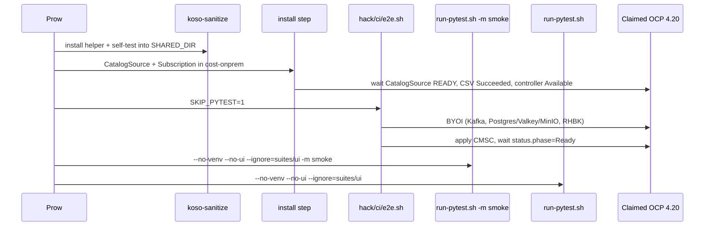

# OpenShift CI job details

This page is the per-job walkthrough. For the high-level map, triggering, and GitHub Actions split, see [openshift-ci.md](openshift-ci.md). For log redaction, see [openshift-ci-redactions.md](openshift-ci-redactions.md).

Config (source of truth):

[`openshift/release` … `project-koku-koku-service-operator-main.yaml`](https://github.com/openshift/release/blob/master/ci-operator/config/project-koku/koku-service-operator/project-koku-koku-service-operator-main.yaml)

## Shared cluster-claim settings

`e2e-olm`, `e2e-pytest`, and `e2e-iqe` all use:

```yaml
cluster_claim:
  architecture: amd64
  cloud: aws
  owner: openshift-ci
  product: ocp
  version: "4.20"
steps:
  workflow: generic-claim
```

[`generic-claim`](https://github.com/openshift/release/blob/master/ci-operator/step-registry/generic-claim/generic-claim-workflow.yaml):

| Phase | What runs |
|-------|-----------|
| **pre** | [`ipi-install-rbac`](https://github.com/openshift/release/blob/master/ci-operator/step-registry/ipi/install/rbac/ipi-install-rbac-ref.yaml) (give the CI kubeconfig rights on the claimed cluster), [`openshift-configure-cincinnati`](https://github.com/openshift/release/tree/master/ci-operator/step-registry/openshift/configure/cincinnati) |
| **test** | The steps listed on the job |
| **post** | [`gather`](https://github.com/openshift/release/blob/master/ci-operator/step-registry/gather/gather-chain.yaml): must-gather, extra, audit logs |

The claimed cluster is **leased**, not installed by the job. Timeout is 1h for `e2e-olm` and 2h for `e2e-pytest` / `e2e-iqe`. If the job hits the ci-operator step timeout, Prow SIGKILLs the pod and you lose buffered (sanitized) logs — IQE’s own timeout is therefore set **under** 2h (default 5400s) so it can still publish JUnit. See [`scripts/run-iqe-tests.sh`](../../scripts/run-iqe-tests.sh).

Namespaces used:

| Job | Operator / CR namespace | Install mode | Infra namespaces (from BYOI) |
|-----|-------------------------|--------------|------------------------------|
| `e2e-olm` | `koku-service-operator-system` | AllNamespaces (`operator-sdk run bundle`) | none (install only) |
| `e2e-pytest` / `e2e-iqe` | `cost-onprem` | OwnNamespace (OperatorGroup `spec: {}`) | `cost-onprem-infra`, `kafka`, `keycloak` |

OwnNamespace is required for the stack jobs: the operator watches only the namespace it is installed in. See [ownnamespace.md](../development/ownnamespace.md).

The committed BYOI sample uses namespace `cost-byoi` and CR name `cost-management` ([`hack/deploy-byoi.sh`](../../hack/deploy-byoi.sh) defaults). The stack step rewrites those to the Prow names above before apply.

---

## `build`

Always-run container test (no cluster):

```bash
GOFLAGS=-mod=mod go build -o /dev/null ./cmd/main.go
```

This is a compile check only. Unit tests, lint, and Kind e2e stay on GitHub Actions ([`.github/workflows/ci.yml`](../../.github/workflows/ci.yml)).

---

## `images` and the OLM bundle

`images` builds every image listed in the config (operator, e2e runner, catalog). The catalog image depends on the bundle.

`ci-bundle-koku-service-operator-bundle` is the explicit bundle target. It **skips** when the PR only touches docs / markdown / `OWNERS` / `LICENSE` / `PROJECT` / `.gitignore` (`skip_if_only_changed`).

CSV image substitution in the config:

```yaml
substitutions:
- pullspec: quay.io/project-koku/koku-service-operator:v0.0.1
  with: pipeline:koku-service-operator
```

The claimed cluster therefore runs **this PR’s operator image**, not the Quay `v0.0.1` tag. If you bump the CSV version, you must update that `pullspec` and the catalog Dockerfile’s `koku-service-operator.v0.0.1` channel entry in the same `openshift/release` file.

---

## `e2e-olm` — OLM install smoke

**Intent:** prove the bundle installs via OLM. No CMSC, no pytest.

Timeout: 1h. Image: `operator-sdk` (OpenShift origin 4.19 tag from the config `base_images`).

| Step | Action |
|------|--------|
| `install` | Create `koku-service-operator-system`. Run `operator-sdk run bundle ${OO_BUNDLE} --install-mode AllNamespaces --security-context-config restricted --timeout 10m`. Wait for CSV `koku-service-operator.v0.0.1` `Succeeded` and Deployment `koku-service-operator-controller-manager` Available. Write `junit_olm-install.xml`. |

This is the automated counterpart of [olm-bundle-testing.md](../development/olm-bundle-testing.md) (`make bundle-run`), using the **pipeline** bundle instead of a Quay tag.

It does **not** source `koso-sanitize`. Output is install status, not application logs or customer-shaped reports.

---

## `e2e-pytest` — OLM + stack + pytest

**Intent:** install the PR’s catalog, bring the Cost Management stack to `Ready`, then run this repo’s pytest suite (no UI).

Timeout: 2h. Test container: `koku-service-operator-e2e` (has `oc` via `cli: latest`, Python 3.11, pytest, koku-nise).



### Step `project-koku-koso-sanitize`

Registry: [`ci-operator/step-registry/project-koku/koso-sanitize/`](https://github.com/openshift/release/tree/master/ci-operator/step-registry/project-koku/koso-sanitize).

Copies the sanitizer into `${SHARED_DIR}` and runs a self-test. Later steps `source "${SHARED_DIR}/koso-sanitize.sh"`. Details: [openshift-ci-redactions.md](openshift-ci-redactions.md).

### Step `install`

Applies Namespace, OperatorGroup (`spec: {}` → OwnNamespace), CatalogSource (`image: ${CATALOG_IMG}`, `sourceType: grpc`, restricted security context), and Subscription (`channel: beta`, `installPlanApproval: Automatic`) into **`cost-onprem`**.

Waits:

1. CatalogSource `status.connectionState.lastObservedState=READY` (10m)
2. Subscription `status.installedCSV` non-empty (up to ~10m)
3. That CSV `status.phase=Succeeded` (up to ~10m; fails immediately on `Failed`)
4. Deployment `koku-service-operator-controller-manager` Available (5m)

On exit (success or fail) a `dump` trap writes sanitized `csv-status.txt`, `operator.log`, `catalog.log`, `olm-resources.yaml`, `cmsc-status.txt`, `events.txt` into `${ARTIFACT_DIR}`.

Dynamic `oc` calls use `_run_sanitized` / `_capture_sanitized` so kube API hostnames in errors never hit the Prow log.

### Step `stack`

Runs [`hack/ci/e2e.sh`](../../hack/ci/e2e.sh) with:

```bash
export KUBE_CONTEXT="$(kubectl config current-context)"
export NAMESPACE=cost-onprem
export CR_NAME=cost-onprem
export INFRA_NAMESPACE=cost-onprem-infra
export OPERATOR_NAMESPACE=cost-onprem
export SKIP_PYTEST=1
```

`SKIP_PYTEST=1` is required: pytest lives in later steps so a pytest failure does not skip artifact dump from the stack, and smoke/full can publish separate JUnit files.

What `e2e.sh` does (operator **must already be installed**):

| Phase | Script / fixture | Result |
|-------|------------------|--------|
| Pin kubeconfig | isolated flattened kubeconfig for `$KUBE_CONTEXT` | CI pod cannot drift to another cluster |
| BYOI | [`hack/deploy-byoi.sh`](../../hack/deploy-byoi.sh) → [`scripts/deploy-rhbk.sh`](../../scripts/deploy-rhbk.sh) | Kafka (AMQ Streams), Postgres/Valkey/MinIO in `cost-onprem-infra`, RHBK in `keycloak`, OAuth secret mirror. No sibling `cost-onprem-chart` clone. |
| Secret aliases | copies `byoi-*` secrets to `{CR_NAME}-*` names | Pytest fixtures expect `{cr.name}-db-credentials` etc. |
| CMSC | [`config/samples/byoi/app/costmanagementserviceconfig.yaml`](../../config/samples/byoi/app/costmanagementserviceconfig.yaml) | awk rewrites `cost-byoi` / `cost-management` / `cost-byoi-infra` to Prow NS/CR/infra, plus domain and Kafka bootstrap. `ros.enabled` as in the sample (beta: typically false). |
| Keycloak issuer | [`hack/ci/inject_cmsc_issuer.py`](../../hack/ci/inject_cmsc_issuer.py) + merge-patch | `issuerURL` = `https://<keycloak route>` (tokens); JWKS stays on in-cluster `url`; `tls.insecureSkipVerify: true` because claimed-cluster ingress certs are not in the oauth2-proxy trust store |
| Ready | `oc wait cmsc/cost-onprem --for=jsonpath='{.status.phase}'=Ready` | Default `CMSC_READY_TIMEOUT=45m` |

`KEYCLOAK_ADMIN_VIA` defaults to `port-forward` in this script because the Prow pod cannot reach Hive apps Routes for the Keycloak Admin API.

No-cluster regression tests for issuer injection: [`hack/ci/e2e_test.sh`](../../hack/ci/e2e_test.sh) (run via `make test-hack` on GitHub Actions).

Do **not** call Helm / [`scripts/install-cmsc.sh`](../../scripts/install-cmsc.sh) on this path. The operator reconciles the CMSC.

### Step `smoke`

```bash
./scripts/run-pytest.sh --no-venv --no-ui --ignore=suites/ui -m smoke
```

`--no-venv`: Python deps are already in `koku-service-operator-e2e`. `--no-ui` / `--ignore=suites/ui`: no Playwright in this image. Marker `smoke` is the cheap gate (see [`test/pytest/pytest.ini`](../../test/pytest/pytest.ini)).

The runner writes `test/pytest/reports/junit.xml` (and `report.html` when pytest-html is present). Prow copies those into `${ARTIFACT_DIR}` as:

- `${ARTIFACT_DIR}/junit_smoke.xml`
- `${ARTIFACT_DIR}/pytest_report.html`

### Step `pytest`

Same runner **without** `-m smoke` (still `--no-venv --no-ui --ignore=suites/ui`). Default mark expression still excludes `ui`, `performance`, and `helm`.

Same workspace paths as smoke (`test/pytest/reports/`). Prow copies them as:

- `${ARTIFACT_DIR}/junit_e2e.xml`
- `${ARTIFACT_DIR}/pytest_report.html`

Env for both pytest steps:

```bash
NAMESPACE=cost-onprem
CR_NAME=cost-onprem
HELM_RELEASE_NAME=cost-onprem   # resource prefix (app.kubernetes.io/instance), not a Helm release
KUBE_CONTEXT=<claimed cluster>
```

Reproduce locally / on Cluster Bot: [clusterbot-operator-pytest.md](../development/clusterbot-operator-pytest.md). The Prow difference is OLM catalog install instead of `hack/deploy-incluster.sh`.

---

## `e2e-iqe` — OLM + stack + IQE smoke

Same `sanitize` → `install` → `stack` → `smoke` as `e2e-pytest`. The last step is IQE instead of full pytest.

### Step `iqe`

```bash
export IQE_TEST_RUN=True
./scripts/run-iqe-tests.sh --profile smoke
```

[`scripts/run-iqe-tests.sh`](../../scripts/run-iqe-tests.sh) creates pod `iqe-cost-tests` in `cost-onprem` from `quay.io/cloudservices/iqe-tests:cost-management`, wires Keycloak client secrets, and runs IQE cost-management tests.

`--profile smoke` ([`scripts/lib/iqe-filters.sh`](../../scripts/lib/iqe-filters.sh)):

- Positive `-k`: `test_api_ocp_source or test_api_cost_model_ocp`
- Skip infra / slow / delta / flaky groups
- On the order of ~40 tests / ~17 minutes (numbers drift; treat as order-of-magnitude)

The script writes `tests/reports/iqe_junit.xml` (note `tests/`, not `test/pytest/`). Prow copies that (and HTML if present) into `${ARTIFACT_DIR}` as:

- `${ARTIFACT_DIR}/junit_iqe.xml`
- `${ARTIFACT_DIR}/iqe_report.html`

`IQE_TIMEOUT` defaults to 5400s so the script can collect JUnit before the 2h ci-operator timeout. Keep that margin if you lengthen the profile.

Other profiles (`extended`, `stable`, `full`) are for lab / future periodics, not this presubmit.

---

## Artifacts cheat sheet

| File | Job / step | Meaning |
|------|------------|---------|
| `junit_olm-install.xml` | `e2e-olm` / install | Single synthetic testcase for CSV + controller |
| `junit_smoke.xml` | pytest + IQE jobs / smoke | Pytest `-m smoke` |
| `junit_e2e.xml` | `e2e-pytest` / pytest | Full non-UI pytest |
| `junit_iqe.xml` | `e2e-iqe` / iqe | IQE smoke |
| `pytest_report.html` / `iqe_report.html` | pytest / iqe | HTML in `${ARTIFACT_DIR}` (copied from `test/pytest/reports/` or `tests/reports/`; not the script’s native filename) |
| `csv-status.txt`, `operator.log`, `catalog.log`, `olm-resources.yaml`, `events.txt` | install dump trap | OLM failure diagnosis |
| `cmsc-status.txt` | install dump trap | CMSC conditions if the CR already exists |
| gather / must-gather | `generic-claim` post | Cluster-level diagnostics |

Prow also collects JUnit from `${ARTIFACT_DIR}/junit*.xml` for the job’s test pane.

---

## What these jobs do **not** run

| Suite | Where it lives | Prow today |
|-------|----------------|------------|
| UI Playwright | [`test/pytest/suites/ui/`](../../test/pytest/suites/ui/) | Excluded (`--no-ui`) |
| Performance | [`test/pytest/suites/performance/`](../../test/pytest/suites/performance/) | Excluded (`--no-ui` markexpr) |
| Helm chart tests | [`test/pytest/suites/helm/`](../../test/pytest/suites/helm/) | Excluded (operator path) |
| Go CMSC lifecycle | [`test/e2e/cmsc_*.go`](../../test/e2e/) / [cmsc-e2e.md](../development/cmsc-e2e.md) | Not wired ([COST-7699](https://redhat.atlassian.net/browse/COST-7699)) |
| Kind `make test-e2e` | [`test/e2e/e2e_test.go`](../../test/e2e/e2e_test.go) | GitHub Actions only |
| IQE extended/stable/full | [`scripts/lib/iqe-filters.sh`](../../scripts/lib/iqe-filters.sh) | Not scheduled |

---

## Debugging a failed Prow e2e

1. Open the job from the PR check or [Prow](https://prow.ci.openshift.org/?repo=project-koku%2Fkoku-service-operator).
2. Identify the failing **step** in the spyglass / build log (`install`, `stack`, `smoke`, `pytest`, `iqe`).
3. If sanitizer self-test failed, the job never reached install — see [openshift-ci-redactions.md](openshift-ci-redactions.md).
4. If install failed: `csv-status.txt`, `catalog.log`, `operator.log`. Typical issues: catalog image not serving, CSV install-mode / SCC, substituted operator image not pullable.
5. If stack failed before Ready: `hack/ci/e2e.sh` dump (operator log, CMSC conditions). Typical issues: Kafka/RHBK timeouts, missing `issuerURL` (Envoy 401s later), S3/MinIO preflight.
6. If pytest/IQE failed: JUnit + HTML report. Reproduce with [clusterbot-operator-pytest.md](../development/clusterbot-operator-pytest.md) using the same `NAMESPACE` / `CR_NAME` / `--no-ui` flags.
7. Remember: hosts, URLs, tokens, and RFC1918 addresses in logs are **redacted**. You will see `[internal-host redacted]` / `[URL redacted]` rather than the Hive API URL.

---

## Mapping Prow steps → this repo

| Prow step | This repo |
|-----------|-----------|
| Catalog / CSV wait | (inline in `openshift/release` config; no script) |
| `stack` | [`hack/ci/e2e.sh`](../../hack/ci/e2e.sh) → [`hack/deploy-byoi.sh`](../../hack/deploy-byoi.sh) → [`scripts/deploy-rhbk.sh`](../../scripts/deploy-rhbk.sh) → [`hack/ci/inject_cmsc_issuer.py`](../../hack/ci/inject_cmsc_issuer.py) |
| CMSC sample | [`config/samples/byoi/app/costmanagementserviceconfig.yaml`](../../config/samples/byoi/app/costmanagementserviceconfig.yaml) |
| `smoke` / `pytest` | [`scripts/run-pytest.sh`](../../scripts/run-pytest.sh) → [`test/pytest/`](../../test/pytest/) (`test/pytest/reports/` in the workspace) |
| `iqe` | [`scripts/run-iqe-tests.sh`](../../scripts/run-iqe-tests.sh) → [`scripts/lib/iqe-filters.sh`](../../scripts/lib/iqe-filters.sh) (`tests/reports/iqe_junit.xml` in the workspace) |
| Local OLM analogue | [olm-bundle-testing.md](../development/olm-bundle-testing.md) |
| Local pytest analogue | [clusterbot-operator-pytest.md](../development/clusterbot-operator-pytest.md) |
