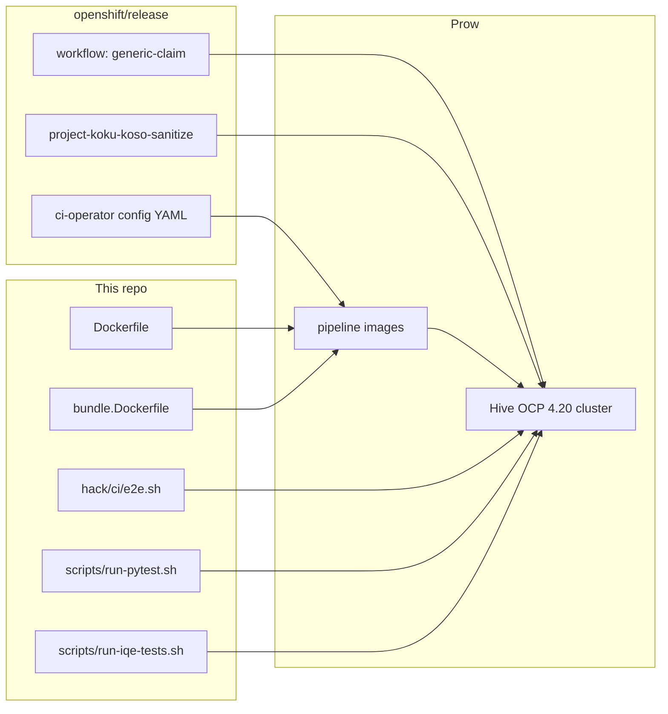

# OpenShift CI (Prow) for koku-service-operator

This repo has two CI systems:

| System | Where it runs | What it covers |
|--------|---------------|----------------|
| **GitHub Actions** | GitHub-hosted runners | Lint, unit/envtest, Kind e2e, generated-code drift, container/bundle publish |
| **OpenShift CI (Prow)** | [api.ci.openshift.org](https://docs.ci.openshift.org/) | Real OCP 4.20 cluster: OLM install, full Cost Management stack, pytest, IQE |

GitHub Actions never claims an OpenShift cluster. Prow is the path that installs the operator with OLM onto a Hive-managed AWS OCP cluster and exercises the live stack.

The Prow **job definitions do not live in this repository**. They live in [`openshift/release`](https://github.com/openshift/release). This repo supplies the images, install scripts, pytest/IQE runners, and BYOI fixtures that those jobs execute.

| Related docs | When to use |
|--------------|-------------|
| [openshift-ci-jobs.md](openshift-ci-jobs.md) | Step-by-step for `e2e-olm`, `e2e-pytest`, `e2e-iqe` |
| [openshift-ci-redactions.md](openshift-ci-redactions.md) | Fail-closed log/artifact redaction (`koso-sanitize`) |
| [olm-bundle-testing.md](../development/olm-bundle-testing.md) | Local `operator-sdk run bundle` (what `e2e-olm` automates) |
| [clusterbot-operator-pytest.md](../development/clusterbot-operator-pytest.md) | Reproduce the pytest path on Cluster Bot / MCE |
| [cmsc-e2e.md](../development/cmsc-e2e.md) | Go lifecycle e2e (not wired into Prow yet; [COST-7699](https://redhat.atlassian.net/browse/COST-7699)) |
| [BYOI samples](../../config/samples/byoi/README.md) | Infra + CMSC fixtures the stack step rewrites for Prow |
| [test/pytest/README.md](../../test/pytest/README.md) | Pytest suites, markers, reports |

## Jobs at a glance

Source of truth: [`ci-operator/config/project-koku/koku-service-operator/project-koku-koku-service-operator-main.yaml`](https://github.com/openshift/release/blob/master/ci-operator/config/project-koku/koku-service-operator/project-koku-koku-service-operator-main.yaml) in `openshift/release`.

Generated Prow job YAML (do not edit by hand): [`ci-operator/jobs/.../project-koku-koku-service-operator-main-presubmits.yaml`](https://github.com/openshift/release/blob/master/ci-operator/jobs/project-koku/koku-service-operator/project-koku-koku-service-operator-main-presubmits.yaml).

| Prow context | `/test` trigger | Auto-runs on PR? | Required to merge? | What it does |
|--------------|-----------------|------------------|--------------------|--------------|
| `ci/prow/build` | `/test build` | Yes | Yes | `go build ./cmd/main.go` in the CI build root |
| `ci/prow/images` | `/test images` | Yes | Yes | Build operator, e2e runner, and OLM catalog images |
| `ci/prow/ci-bundle-koku-service-operator-bundle` | `/test ci-bundle-koku-service-operator-bundle` | Yes, except docs-only PRs | Yes (when it runs) | Build the OLM bundle image |
| `ci/prow/e2e-olm` | `/test e2e-olm` | **No** | **No** (optional) | Claim OCP 4.20, `operator-sdk run bundle`, wait for CSV |
| `ci/prow/e2e-pytest` | `/test e2e-pytest` | **No** | **No** (optional) | Claim OCP 4.20, OLM install, BYOI + CMSC, pytest |
| `ci/prow/e2e-iqe` | `/test e2e-iqe` | **No** | **No** (optional) | Same stack as pytest, then IQE `--profile smoke` |

There are currently **no periodic** (nightly) jobs for this repo in `openshift/release`.

### Why e2e jobs are optional and not auto-run

Each e2e job claims a Hive cluster pool lease (`product: ocp`, `version: "4.20"`, AWS, amd64) for 1–2 hours. They are `always_run: false` and `optional: true` so they do not consume pool capacity on every PR and do not block merge. Comment `/test e2e-pytest` (or `e2e-olm` / `e2e-iqe`) on the PR when you need them.

## How the pieces fit together



1. Prow checks out this PR and runs **ci-operator** with the config from `openshift/release`.
2. ci-operator builds pipeline images (operator, bundle, catalog, e2e runner).
3. For e2e jobs it **claims** a pre-installed OCP 4.20 cluster from the `openshift-ci` AWS pool ([cluster pools](https://docs.ci.openshift.org/docs/architecture/ci-operator/#testing-with-a-cluster-from-a-cluster-pool)).
4. The [`generic-claim`](https://github.com/openshift/release/blob/master/ci-operator/step-registry/generic-claim/generic-claim-workflow.yaml) workflow grants RBAC onto the claimed cluster (`ipi-install-rbac`), then runs this repo’s test steps, then **gathers** must-gather / extra / audit logs on the way out.
5. The CI **pod is not on the claimed cluster**. `oc`/`kubectl` talk to it over the kube API. Keycloak admin calls use `oc port-forward` (`KEYCLOAK_ADMIN_VIA=port-forward` in [`hack/ci/e2e.sh`](../../hack/ci/e2e.sh)).

## What this repo supplies

Prow YAML lives only in `openshift/release`. This checkout has **no** `openshift/` directory, **no** `.ci-operator.yaml`, **no** catalog Dockerfile, and **no** e2e Dockerfile.

| Lives here | Prow uses it as |
|------------|-----------------|
| [`Dockerfile`](../../Dockerfile) | Operator image (`manager` + `wait-for`; CSV substitution) |
| [`bundle.Dockerfile`](../../bundle.Dockerfile) + committed [`bundle/`](../../bundle/) | Bundle image (`e2e-olm`, catalog input) |
| [`hack/ci/e2e.sh`](../../hack/ci/e2e.sh) | `stack` step (`SKIP_PYTEST=1`) |
| [`hack/deploy-byoi.sh`](../../hack/deploy-byoi.sh) + [`scripts/deploy-rhbk.sh`](../../scripts/deploy-rhbk.sh) | Kafka / Postgres / Valkey / MinIO / RHBK. Prow does **not** clone `cost-onprem-chart`; RHBK is this repo’s script |
| [`config/samples/byoi/`](../../config/samples/byoi/) | Infra + CMSC sample (rewritten for `cost-onprem`) |
| [`scripts/run-pytest.sh`](../../scripts/run-pytest.sh), [`scripts/run-iqe-tests.sh`](../../scripts/run-iqe-tests.sh) | smoke / pytest / iqe steps |
| Root [`OWNERS`](../../OWNERS) | Mirrored into `openshift/release` |

Repo-specific gotchas (details in [openshift-ci-jobs.md](openshift-ci-jobs.md)):

- **Namespace rewrite.** Sample / [`hack/deploy-byoi.sh`](../../hack/deploy-byoi.sh) defaults are namespace `cost-byoi` and CR `cost-management`. Prow and [`hack/ci/e2e.sh`](../../hack/ci/e2e.sh) use `cost-onprem`. The stack step rewrites the sample YAML and copies `byoi-*-credentials` → `{CR_NAME}-{db,cache,storage}-credentials` because pytest expects the CR-prefixed names.
- **No sibling chart on Prow.** `ensure_chart_root` in `e2e.sh` is optional; BYOI falls back to in-repo `scripts/deploy-rhbk.sh`.
- **Catalog and e2e images are not files here.** The catalog Dockerfile is inline in `openshift/release`; the e2e runner is `FROM src` plus Python deps defined there. Local / GitHub Actions catalog publish uses `make catalog-build`, a different path.

## Triggering and watching jobs

On a PR against `main`:

```text
/test build
/test images
/test e2e-olm
/test e2e-pytest
/test e2e-iqe
```

`/test ?` lists available tests. `/retest` retriggers failed required jobs; it does **not** retrigger optional e2e jobs unless you name them.

Prow job index: [prow.ci.openshift.org/?repo=project-koku/koku-service-operator](https://prow.ci.openshift.org/?repo=project-koku%2Fkoku-service-operator).

Job names look like `pull-ci-project-koku-koku-service-operator-main-e2e-pytest`. The PR check context is the shorter `ci/prow/<test>` name.

Artifacts (JUnit, pytest HTML, operator logs, CMSC status) land in the job’s GCS bucket, linked from the Prow UI as **Artifacts**. Redaction rules for those files: [openshift-ci-redactions.md](openshift-ci-redactions.md).

## Images Prow builds

Defined under `images:` and `operator.bundles:` in the [ci-operator config](https://github.com/openshift/release/blob/master/ci-operator/config/project-koku/koku-service-operator/project-koku-koku-service-operator-main.yaml).

| Pipeline image | Built from | Used by |
|----------------|------------|---------|
| `koku-service-operator` | [`Dockerfile`](../../Dockerfile) | Substituted into the CSV (`quay.io/project-koku/koku-service-operator:v0.0.1` → this build) |
| `koku-service-operator-bundle` | [`bundle.Dockerfile`](../../bundle.Dockerfile) | `e2e-olm` (`OO_BUNDLE`); catalog build |
| `koku-service-operator-catalog` | Inline Dockerfile in `openshift/release` (not in this repo): `opm render` the bundle, `olm.package` + `beta` channel, `opm serve` | `e2e-pytest` / `e2e-iqe` CatalogSource |
| `koku-service-operator-e2e` | `FROM src` + Python 3.11, pytest, kubernetes, boto3, koku-nise (defined in `openshift/release`, not a Dockerfile here) | Sanitize + install + stack + test steps |

Build root: OpenShift RHEL 9 golang 1.26 image (`rhel-9-release-golang-1.26-openshift-4.23`). Target cluster release: **OCP 4.20** (`channel: fast`).

The catalog Dockerfile pins CSV `koku-service-operator.v0.0.1` on channel `beta`. That must match the generated bundle’s version and [`bundle/metadata/annotations.yaml`](../../bundle/metadata/annotations.yaml).

## GitHub Actions vs Prow (do not confuse them)

[`.github/workflows/ci.yml`](../../.github/workflows/ci.yml) is **not** the same as Prow e2e:

| Check | GitHub Actions | Prow |
|-------|----------------|------|
| `go build` / lint / `make test` | Yes | `build` only (no golangci-lint) |
| `make test-hack` (issuer injection, RHBK port-forward) | Yes (`hack-scripts`) | No |
| Kind cluster `make test-e2e` | Yes (`e2e` job) | No |
| OLM on real OCP | No | `e2e-olm`, `e2e-pytest`, `e2e-iqe` |
| BYOI + CMSC Ready + pytest | No (use Cluster Bot) | `e2e-pytest` |
| IQE pod in-cluster | No | `e2e-iqe` (`--profile smoke`) |
| Publish `quay.io/project-koku/koku-service-operator*` | Yes, on merge to `main` (`make catalog-build` for catalog) | No (pipeline images are job-local) |

The Go CMSC lifecycle suite (`make test-e2e-cmsc`, [cmsc-e2e.md](../development/cmsc-e2e.md)) is **not** run in either system yet.

## Prow plugins and merge

[`_pluginconfig.yaml`](https://github.com/openshift/release/blob/master/core-services/prow/02_config/project-koku/koku-service-operator/_pluginconfig.yaml) enables `approve`, `lgtm` (reviews count as LGTM), `trigger`, `hold`, `wip`, `override`, and the Jira lifecycle plugin. [`_prowconfig.yaml`](https://github.com/openshift/release/blob/master/core-services/prow/02_config/project-koku/koku-service-operator/_prowconfig.yaml) leaves GitHub branch protection **unmanaged** (`unmanaged: true`) so rules stay in GitHub.

OWNERS files under `openshift/release` for this repo are generated from this repo’s root [`OWNERS`](../../OWNERS).

## Changing Prow jobs

1. Edit the config in **`openshift/release`**, not here:
   [`ci-operator/config/project-koku/koku-service-operator/project-koku-koku-service-operator-main.yaml`](https://github.com/openshift/release/blob/master/ci-operator/config/project-koku/koku-service-operator/project-koku-koku-service-operator-main.yaml).
2. Never hand-edit `ci-operator/jobs/...`. Run `make update` in `openshift/release`.
3. Reusable steps live under [`ci-operator/step-registry/project-koku/`](https://github.com/openshift/release/tree/master/ci-operator/step-registry/project-koku).
4. Scripts that the jobs **call** (`hack/ci/e2e.sh`, `scripts/run-pytest.sh`, `scripts/run-iqe-tests.sh`) live **here**. A Prow job change often needs a matching script change in this repo (or vice versa).

OpenShift CI reference: [docs.ci.openshift.org](https://docs.ci.openshift.org/), [ci-operator spec](https://steps.ci.openshift.org/ci-operator-reference).
